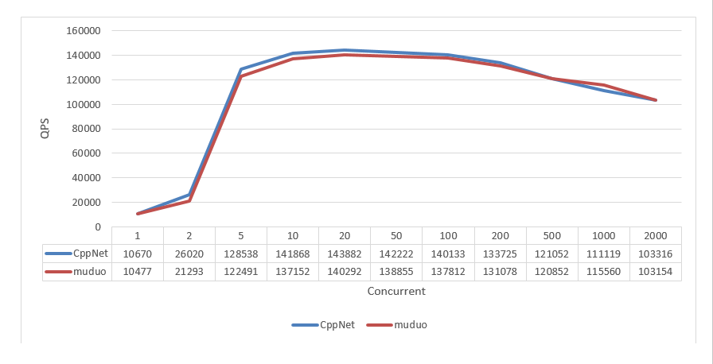

<p align="left"></p>

<p align="left">
    <a href="https://travis-ci.org/caozhiyi/CppNet"></a>
    <a href="https://opensource.org/licenses/BSD-3-Clause"></a>
</p> 

See [chinese](/README_cn.md) 
## Introduction

CppNet is a proactor mode and multithreaded network with C++11 on tcp.   
 Simple: only export a little interfaces, all net ios insterface are asynchronous callbacks, as much as possible like calling the socket API of the system. There is only one additional buffer object type for the client.       
 Fast: epoll and IOCP are used, in which epoll multithreaded threads are handled by the Linux kernel through port reuse. Each socket has a single memory pool object. All memory requested from the memory pool is managed by an intelligent pointer.    
 Clear：three layers: event-driven layer, session management layer and interface layer, upward notification through callbacks between layers. Clear division of responsibilities among modules, pay to Caesar what belongs to Caesar and God what belongs to God. The largest class does not exceed 500 lines of code.   

## Interface

All the interface files are in [include](/include). The interface definitions for library initialization and timer are in [CppNet](/include/CppNet.h):    
```c++
    // common
    // init cppnet library.
    // thread_num:       the number of running threads.
    // log:              print log out?
    // per_handl_thread: every thread with a epoll handle. only useful in linux.
    void Init(int32_t thread_num, bool log = false, bool per_handl_thread = true);
    void Dealloc();

    // thread join
    void Join();

    // must set callback before listen
    void SetReadCallback(const read_call_back& func);
    void SetWriteCallback(const write_call_back& func);
    void SetDisconnectionCallback(const connection_call_back& func);

    //timer
    uint64_t SetTimer(int32_t interval, const timer_call_back& func, void* param = nullptr, bool always = false);
    void RemoveTimer(uint64_t timer_id);

    //server
    void SetAcceptCallback(const connection_call_back& func);
    bool ListenAndAccept(int16_t port, std::string ip);

    //client
    void SetConnectionCallback(const connection_call_back& func);
```
Since all network IO interfaces are defined as callback notification modes, callback functions for each call need to be set when initializing the library.     
By setting callbacks instead of providing virtual function inheritance, we hope to be as simple as possible, reduce the inheritance relationship of classes, and increase the flexibility of callbacks. You can set callbacks to any function.         
The interface definition for network IO are in [Socket](/include/Socket.h):      
```c++
    // get socket ip and adress
    int16_t GetIpAddress(const Handle& handle, std::string& ip, uint16_t& port);
    // post sync write event.
    int16_t Write(const Handle& handle, const char* src, int32_t len);
    // post a sync task to io thread
    int16_t PostTask(std::function<void(void)>& func);
#ifndef __linux__
    // sync connection. 
    int16_t Connection(const std::string& ip, int16_t port, const char* buf, int32_t buf_len);
#endif
    int16_t Connection(const std::string& ip, int16_t port);

    int16_t Close(const Handle& handle);
```
The function of the interface is evident through declarations and annotations. Attention should be paid to the error code returned by the interface, defined in [CppDefine](/include/CppDefine.h):    
```c++
    enum CPPNET_ERROR_CODE {
        CEC_SUCCESS                = 1,    // success.
        CEC_TIMEOUT                = 2,    // the event time out call back.
        CEC_CLOSED                 = 3,    // remote close the socket.
        CEC_INVALID_HANDLE         = 4,    // invalid cppnet handle, can't find in socket manager.
        CEC_FAILED                 = 5,    // call function failed.
        CEC_CONNECT_BREAK          = 6,    // connect break.
        CEC_CONNECT_REFUSE         = 7     // remote refuse connect or server not exist.
    };
```
When each interface takes the next action, you should first check the error code returned at present to know whether the current connection is normal. 

## Example

Simple use examples can be seen [CppNetServer](/CppNetSev/CppNetServer.cpp) and [CppNetClient](/CppNetCli/CppNetClient.cpp)。   
Other simples are in [test](/test). [echo](/test/echo): The test program of echo with 10000 connection. [http](/test/http): A simple HTTP server is implemented with reference to muduo.
## Efficiency
Only use apache ab test HTTP echo，comparison with Muduo. The command executed is：ab -kc[1-2000] -n100000 http://127.0.0.1:8000/hello.
<p align="left"></p>

## Build(Windows)

You can compile CppNet library and example with vs2017.   

## Build(Linux)

The CppNet library and examples can be compiled simply by executing make in the source directory.     
Other examples need to make in local directories after compiling static libraries.     
```
$ make
```

## Licenses

This program is under the terms of the BSD 3-Clause License. See [https://opensource.org/licenses/BSD-3-Clause](https://opensource.org/licenses/BSD-3-Clause).
