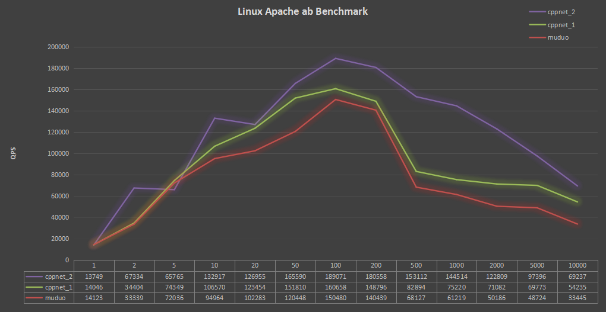
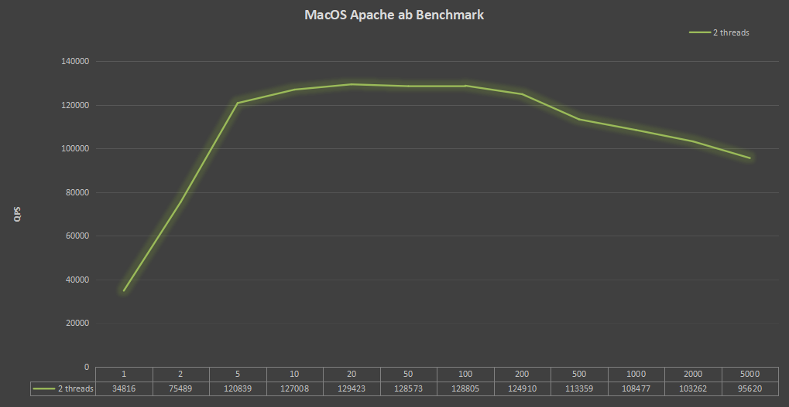

# Apache ab Benchmark

Apache `ab` is a commonly used tool for HTTP server pressure testing. I press test the `http` test service in the `cppnet` test directory on different platforms, The command to be executed is: 
```shell
ab -kc[1-10000] -n100000 http://127.0.0.1:8921/hello
```
Execute the above command three times each time, take the highest value of QPS among the three times, and draw the test result as a line chart.     
In the line chart, the ordinate is QPS and the abscissa is concurrent value.    

### Linux

**environment**：   
- the system environment is `WSL2` in windows
- the operating system is `Ubuntu20.04`
- system memory `16G DDR3 2666Mhz`
- CPU is `i7-6700 @ 3.40GHz` four cores
- compile optimized `-O2`
- all tests have `2` threads

Compared with `Muduo` on Linux，because Linux support `REUSE_PORT` and `EPOLLEXCLUSIVE`, so I added a comparison of two different options, The results are shown in the figure below
<p align="left"></p>

In the picture `cppnet_1` used `REUSE_PORT`，`cppnet_2` used `EPOLLEXCLUSIVE`.    
When use `REUSE_PORT`, efficiency is slightly better than `muduo`.       
When use `EPOLLEXCLUSIVE`, the overall performance is better than `muduo`(muduo does not support the `EPOLLEXCLUSIVE` setting).  

### Windows

**environment**：   
- The system environment is physical real machine
- the operating system is `Windows 10 @ 19042.985`
- system memory `16G DDR3 2666HZ`
- CPU is `i7-6700 @ 3.40GHz` four cores
- compile optimized `/O2`

Because `IOCP` is used in the Windows, the system kernel is responsible for managing the thread pool, and each socket wake-up operation will be executed on different threads, which is quite different from Linux and MacOS. Therefore, the pressure test performance of different number of threads is specially listed, The results are shown in the figure below
<p align="left"></p>

### MacOS

**environment**：   
- The system environment is physical real machine
- the operating system is `MacOS @ 10.15.4`
- system memory `8G DDR3 2133Mhz`
- CPU is `i5-8257U @ 1.40GHz` four cores
- compile optimized `-O2`
- `2` threads

The results are shown in the figure below
<p align="left"></p>

### Result
It is difficult to have both cross platform and high performance. Due to the Linux platform developed first, the windows platform adapted later, the usage of `IOCP` is very different from `epoll` and `kqueue`. There are many thread safe locks on Windows, The performance of `IOCP` is not displayed, so the performance on Windows is normal.     
On Linux and MacOS, most QPS can exceed 100000 under normal concurrency conditions, the performance is excellent.    